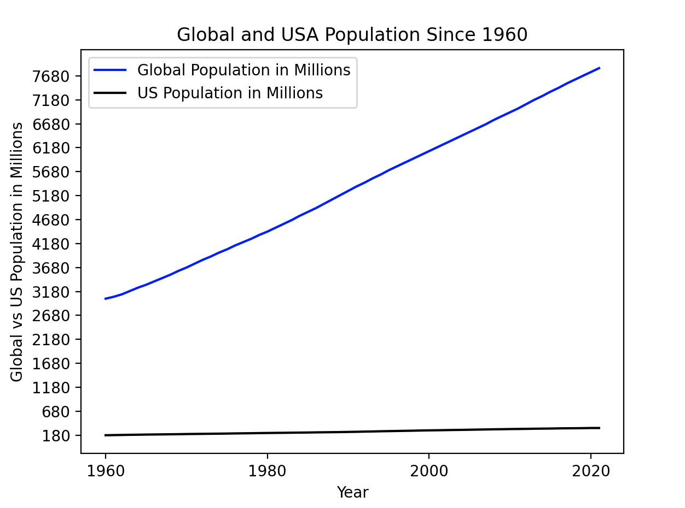
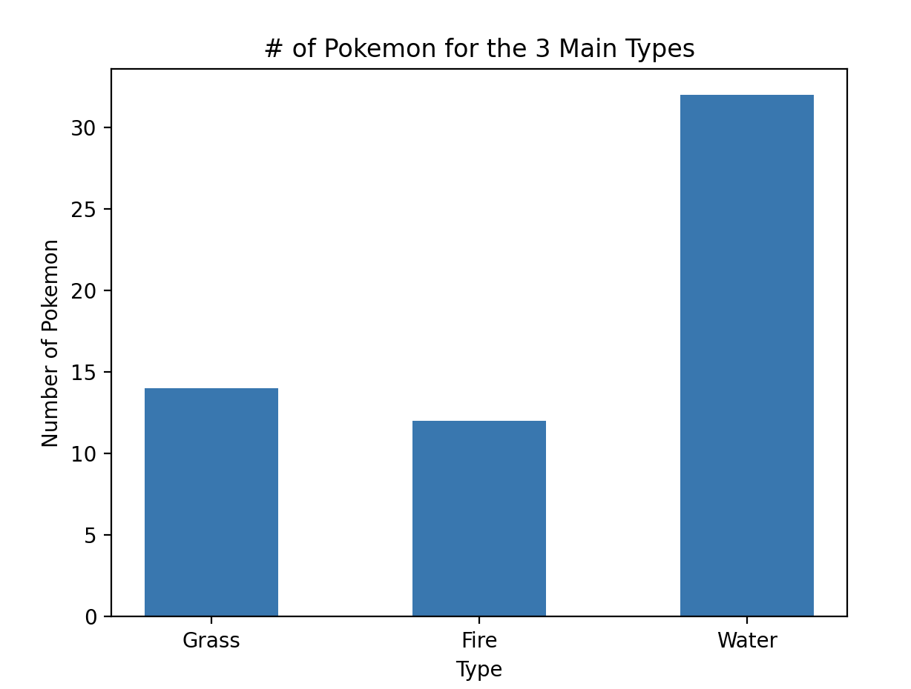

# Project 2: Data Visualization [GitHub Link](https://github.com/mikeizbicki/cmc-csci040/tree/2022fall/project_02)

## Graph 1: US Population vs. Global Population [(Source 1)](https://www.kaggle.com/datasets/jarredpriester/global-population?resource=download) [(Source 2)](https://fred.stlouisfed.org/series/POPTOTUSA647NWDB)

## Graph 2: Pokemon Count [(Data Source)](https://raw.githubusercontent.com/Biuni/PokemonGO-Pokedex/master/pokedex.json)

